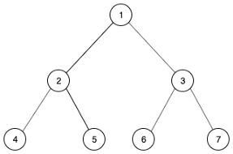
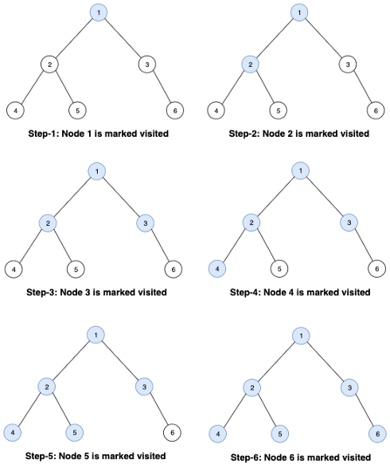
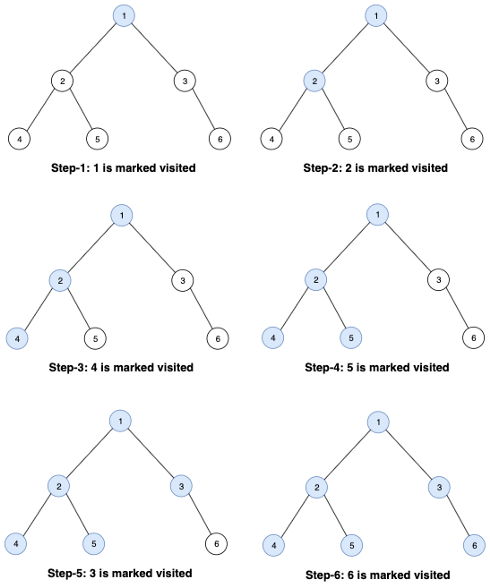
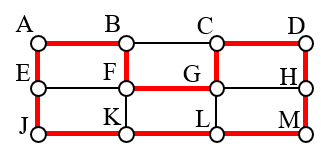
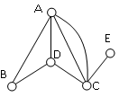
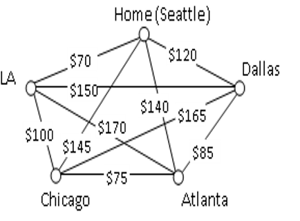

[comment]: <> (Do sirky vs do hlbky)
# Week 2 

This lab is about traversing or searching through tree data structure. A tree is nonlinear data structure. It does not store any data linearly like arrays or linked lists but stores it hierarchically.

We’ll be discussing two popular search algorithms: breadth-first search (BFS) and depth-first search (DFS) and its applications. We’ll also see which one performs better and when.

## Breadth-First Search (BFS) // prehľadávanie do šírky

BFS stands for Breadth First Search is a vertex based technique for finding a shortest path in graph. The nodes at the same level are visited first (then the nodes in the levels below). A **level** is the number of connections between the root node and node + 1.

The implementation can be done using a queue [a queue is a data structure used to store objects, where objects are inserted and removed according to the first-in-first-out (FIFO) principle]:

1. Start with root node. Mark it visited.
2. Push its left child node and right child node to the queue.
3. Pop a node from the queue and mark it as visited. Push its left child node and right child node to the queue.
4. Repeat Step 3 until the queue is empty.

### Time complexity

The time complexity is the same as **DFS—O(V+E)**, where **V** is the number of vertices and **E** is the number of edges.

### Space complexity

The space complexity is O(l), where l is the maximum number of nodes in a single level.

### Applications

1. BFS is used to find the shortest path between two nodes.
2. It’s used to find neighbouring locations in GPS systems.
3. It’s also used in finding all the neighbouring nodes in a peer-to-peer network like BitTorrent.

## Depth-First Search (DFS) // prehľadávanie do hĺbky

DFS is a search algorithm to traverse through a tree. The search is done by visiting a node and then all the child nodes before visiting its siblings (nodes with the same parent are called siblings).

The implementation can be done using a stack [a stack is a data structure used to store objects, where objects are inserted and removed according to the last-in-first-out (LIFO) principle]:

1. Start with root node. Mark it visited.
2. Push its left child node and right child node to the stack.
3. Pop a node from the stack, and mark it as visited. Push its left child node and right child node to the stack.
4. Repeat Step 3 with each unvisited node.

### Time complexity

The time complexity is **O(V+E)**, where **V** is the number of vertices and **E** is the number of edges.

### Space complexity

The space complexity is O(h), where h is the maximum height of the tree.

### Applications

1. DFS is used to find the path between two nodes.
2. It can be used to do topological sorting, which can be used to schedule the jobs from given dependencies among them.
3. It can be also be used to find the solution to a puzzle — e.g., finding a path out of a maze, with the path stored in a stack.

## Which One Should You Choose: BFS or DFS?

The time complexity of both algorithms is the same. But in the case of space complexity, if the maximum height is less than the maximum number of nodes in a single level, then DFS will be more space optimised than BFS or vice versa.

So if the problem involves finding the nearest neighbour or the shortest path, BFS performs better — as in the case of DFS, leaf nodes are visited first.

But in the case of solving a puzzle or topological sorting (i.e., cases where the result needs to be evaluated on reaching leaf nodes), DFS performs better.

| BFS                                                                                                                                                                | DFS                                                                                                                                                                               |
|--------------------------------------------------------------------------------------------------------------------------------------------------------------------|-----------------------------------------------------------------------------------------------------------------------------------------------------------------------------------|
| BFS can be used to find single source shortest path in an unweighted graph, because in BFS, we reach a vertex with minimum number of edges from a source vertex | In DFS, we might traverse through more edges to reach a destination vertex from a source.                                                                                         |
| BFS is more suitable for searching vertices which are closer to the given source.                                                                                  | DFS is more suitable when there are solutions away from source.                                                                                                                   |
| BFS considers all neighbors first and therefore not suitable for decision making trees used in games or puzzles.                                                   | DFS is more suitable for game or puzzle problems. We make a decision,  then explore all paths through this decision. And if this decision leads  to win situation, we stop. |
| BFS is slower than DFS.                                                                                                                                            | DFS is faster than BFS.                                                                                                                                                           |

[Graph example](https://www.cs.usfca.edu/~galles/visualization/BFS.html)

[Your own graph example](https://visualgo.net/en/dfsbfs)

[DFS and BFS in Maze](https://clementmihailescu.github.io/Pathfinding-Visualizer/#)

[comment]: <> (Hamilton)

## Hamilton Circuits and the Traveling Salesman Problem

Hamiltonian paths and circuits are named for William Rowan Hamilton who studied them in the 1800's. Sometimes you will see them referred to simply as Hamilton paths and circuits.

**A Hamiltonian circuit** is a circuit that visits every vertex once with no repeats. Being a circuit, it must start and end at the same vertex.

**A Hamiltonian path** also visits every vertex once with no repeats, but does not have to start and end at the same vertex.

### Example 1

One Hamiltonian circuit is shown on the graph below. There are several other Hamiltonian circuits possible on this graph. Notice that the circuit only has to visit every vertex once; it does not need to use every edge.

This circuit could be notated by the sequence of vertices visited, starting and ending at the same vertex: ABFGCDHMLKJEA. Notice that the same circuit could be written in reverse order, or starting and ending at a different vertex.

### Example 2

Does a Hamiltonian path or circuit exist on the graph below?

We can see that once we travel to vertex E there is no way to leave without returning to C, so there is no possibility of a Hamiltonian circuit. If we start at vertex E we can find several Hamiltonian paths, such as ECDAB and ECABD.

With Hamiltonian circuits, our focus will not be on existence, but on the question of optimization; given a graph where the edges have weights, can we find the optimal Hamiltonian circuit; the one with lowest total weight.

**Traveling salesman problem (TSP):**  Suppose a salesman needs to give sales pitches in five cities. He looks up the airfares between each city, and puts the costs in a graph. In what order should he travel to visit each city once then return home with the lowest cost? A situation like this could be represented with the graph shown.

## First assigment: Overview of Artificial Intelligence applications

### Informations
  

Group size: 2 people or alone  
Language: English or Slovak 
Number of pages: 5 (**at least** without references) 
Number of references:  4 (**at least**) 
Tool: Overleaf  
Template: Overleaf->IEEE official templates-> IEEE Demo Template for Computer Society Conferences

### Article evaluation (15 points)
- **Content** (8 points) - Quality of references, Plagiarism
- **Style** (3 points)
- **Presentation** (4 points) - ** Online in week 7!!!**

### Topics available:
   * AI in Medicine
   * AI in Military
   * AI in Everyday life
   * AI in Economics
   * Autonomous cars
   * Drones
   * AI in Social Medias
   * AI in Art
   * AI in Cybersecurity
   * AI in Gaming
   * AI tools for computer science
   * AI in Agriculture
   * AI in Education
   * AI in Sports
   * Your own topic

If you have already chosen your topic, [sign up here!](https://docs.google.com/spreadsheets/d/10tQ9tD2hO3lPfGGQ_6kfTb3k8nCbhSyf7ix51nxAksE/edit?usp=sharing) Do not forget to pick the right sheet(based on time when you have your labs).
