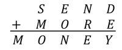

## SEND MORE MONEY

**Definition:** Solve if each letter is a distinct digit. (M &ne; 0 , S &ne; 0)

**Deadline**: 6th week

**Programming language**: IT'S UP TO YOU !!!

**Grading**: 10 points and extra points for most effective solutions! - ** You have to be able to fully explain your code! No plagiarism! **

**Definícia:** [SEND MORE MONEY](http://www.cloudai.sk/wp-content/uploads/2019/10/ai_zadanie_money.pdf)

**Problem explained in video:** [SEND MORE MONEY - youtube video](https://www.youtube.com/watch?v=p5YjV-100Hc)
