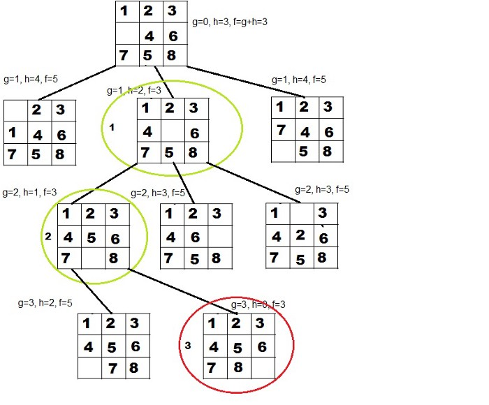
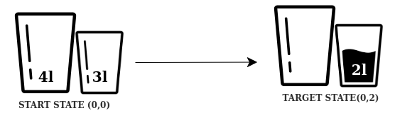

## Week 3

## 8-Puzzle problem

N-Puzzle or sliding puzzle is a popular puzzle that consists of N tiles where N can be 8, 15, 24, and so on. In our example N = 8. The puzzle is divided into sqrt(N+1) rows and sqrt(N+1) columns. 15-Puzzle will have 4 rows and 4 columns and an 8-Puzzle will have 3 rows and 3 columns.

**Problem statement:** The puzzle consists of N tiles and one empty space where the tiles can be moved. Start and Goal configurations (also called state) of the puzzle are provided. The puzzle can be solved by moving the tiles one by one in the single empty space and thus achieving the Goal configuration.

The tiles in the initial(start) state can be moved in the empty space in a particular order and thus achieve the goal state.

[Is my Puzzle problem Solvable?](https://www.geeksforgeeks.org/check-instance-15-puzzle-solvable/)

### Rules for solving the puzzle

Instead of moving the tiles in the empty space, we can visualize moving the empty space in place of the tile, basically swapping the tile with the empty space. The empty space can only move in four directions:

    1. Up
    2. Down
    3. Right
    4. Left

The empty space cannot move diagonally and can take **only one step at** a time (i.e. move the empty space one position at a time).

You can read more about solving the 8-Puzzle problem [here.](https://www.geeksforgeeks.org/8-puzzle-problem-using-branch-and-bound/)

## Heuristic Search ##

Basically, there are two types of searching techniques :

    1. Uninformed Search
    2. Informed Search

You might have heard about Linear Search, Binary Search, Depth-First Search, or the Breadth-First Search. These searching algorithms fall into the category of uninformed search techniques i.e. these algorithms do not know anything about what they are searching for and where they should search for it. That’s why the name **“uninformed”** search. Uninformed searching takes a lot of time to search as it doesn’t know where to head and where the best chances of finding the element are.

Informed search is exactly opposite to the uninformed search. In this, the algorithm is aware of where the best chances of finding the element are and the algorithm heads that way!** Heuristic search** is an informed search technique. A heuristic value tells the algorithm which path will provide the solution as early as possible. The heuristic function is used to generate this heuristic value. Different heuristic functions can be designed depending on the searching problem. So we can conclude that **Heuristic search is a technique that uses a heuristic value for optimizing the search.**

## A* Algorithm ##

#### Shakey project

Shakey the Robot was the first general-purpose mobile robot to be able to reason about its own actions. While other robots would have to be instructed on each individual step of completing a larger task, Shakey could analyze commands and break them down into basic chunks by itself.

Due to its nature, the project combined research in robotics, computer vision, and natural language processing. Because of this, it was the first project that melded logical reasoning and physical action. Shakey was developed at the Artificial Intelligence Center of Stanford Research Institute (now called SRI International). 

### History

**A\*** was created as part of the Shakey project, which had the aim of building a mobile robot that could plan its own actions. Nils Nilsson originally proposed using the Graph Traverser algorithm for Shakey's path planning. Graph Traverser is guided by a heuristic function **h(n)**, the estimated distance from node n to the goal node: it entirely ignores **g(n)**, the distance from the start node to **n**. Bertram Raphael suggested using the sum, **g(n) + h(n)**. Peter Hart invented the concepts we now call admissibility and consistency of heuristic functions. **A\*** was originally designed for finding least-cost paths when the cost of a path is the sum of its costs, but it has been shown that A* can be used to find optimal paths for any problem satisfying the conditions of a cost algebra.o 

**A\* **is a computer algorithm that is widely used in pathfinding and graph traversal, the process of plotting an efficiently traversable path between multiple points, called nodes. Noted for its performance and accuracy, it enjoys widespread use.

The key feature of the **A\* algorithm** is that it keeps a track of each visited node which helps in ignoring the nodes that are already visited, saving a huge amount of time. It also has a list that holds all the nodes that are left to be explored and it chooses the most optimal node from this list, thus saving time not exploring unnecessary or less optimal nodes.

So we use two lists namely ‘open list‘ and ‘closed list‘ the open list contains all the nodes that are being generated and are not existing in the closed list and each node explored after it’s neighboring nodes are discovered is put in the closed list and the neighbors are put in the open list this is how the nodes expand. Each node has a pointer to its parent so that at any given point it can retrace the path to the parent. Initially, the open list holds the start(Initial) node. The next node chosen from the open list is based on its f score, the node with the least **f score** is picked up and explored.

**f-score = h-score + g-score**

A* uses a combination of heuristic value (h-score: how far the goal node is) as well as the g-score (i.e. the number of nodes traversed from the start node to current node).

In our 8-Puzzle problem, we can define the **h-score** as the number of misplaced tiles by comparing the current state and the goal state or summation of the Manhattan distance between misplaced nodes.
**g-score** will remain as the number of nodes traversed from a start node to get to the current node.

we can calculate the h-score by comparing the initial(current) state and goal state and counting the number of misplaced tiles.
Thus, **h-score = 5** and **g-score = 0** as the number of nodes traversed from the start node to the current node is 0.

### How A* solves the 8-Puzzle problem.###

We first move the empty space in all the possible directions in the start state and calculate the **f-score** for each state. This is called expanding the current state.

After expanding the current state, it is pushed into the **closed list** and the newly generated states are pushed into the **open** list. A state with the least f-score is selected and expanded again. This process continues until the goal state occurs as the current state. Basically, here we are providing the algorithm a measure to choose its actions. The algorithm chooses the best possible action and proceeds in that path.

This solves the issue of generating redundant child states, as the algorithm will expand the node with the least **f-score**.

### Applications

**A*** is often used for the common pathfinding problem in applications such as video games, but was originally designed as a general graph traversal algorithm. It finds applications in diverse problems, including the problem of parsing using stochastic grammars in NLP. Other cases include an Informational search with online learning.

Demonstration in python.

[Demostration1](https://clementmihailescu.github.io/Pathfinding-Visualizer/#) and [Demostration2](https://qiao.github.io/PathFinding.js/visual/) in grid world.

## Water tank problem

**Definition:** Let's say we have two empty water tanks. The larger container 

Majme daný orezaný stavový priestor. Vygenerujte preň strom hľadania pre neinformované hľadanie do hĺbky a do šírky a porovnajte výsledky. Počiatočný stav je (0,0) a koncový (0,2).

**[LISP solution](http://people.tuke.sk/marian.mach/plaintexts/slepe_lsp)**

**Bonus**: Navrhnite riešenie v LISP-e riešenie nasledujúceho problému. Gazda sa vracia z trhu, kde kúpil kozu, vlka a kapustu. Na ceste domov sa musí preplaviť cez rieku. Jeho loďka je malá, a preto môže na ňu so sebou vziať iba jednu z troch vecí. Na brehu nemôžu zostať koza a kapusta (pretože by ju koza zjedla), ani koza s vlkom (pretože by vlk zjedol kozu). Ako dostane všetko bez ujmy na druhý breh? Počiatočný stav berme ako (0 0 0 0), v poradí vlk,koza, kapusta a gazda. Požadovaný konečný stav teda bude (1 1 1 1).

**[Online LISP compiler](https://rextester.com/l/common_lisp_online_compiler)**

