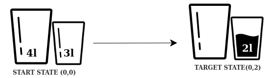

## Water tank problem

**Definition:** Let's say we have two empty water tanks. The larger container 

Majme daný orezaný stavový priestor. Vygenerujte preň strom hľadania pre neinformované hľadanie do hĺbky a do šírky a porovnajte výsledky. Počiatočný stav je (0,0) a koncový (0,2).

